</div>
<p align="center">
  
</p>

<div align="center">


<br/>

    
<br/>
    
</div>


## `> whoami`

<div align="center">
  
</div>

```bash
$ cat ferr.txt

  nombre   →  Ferr
  estudio  →  Programación + Ciberseguridad @ INACAP
  interés  →  CTF, hacking ético, desarrollo web
  hobbies  →  arte digital, gaming, música
  estado   →  siempre aprendiendo...
```


## `> stack`

<div align="center">


</div>


## `> currently learning`

<div align="center">


</div>


## `> stats`

<div align="center">


</div>


## `> proyectos`

<div align="center">

[](https://github.com/Fernandamv96/informe-mundan)

</div>


## `> snake`

<div align="center">

<picture>
  <source media="(prefers-color-scheme: dark)" srcset="https://raw.githubusercontent.com/Fernandamv96/Fernandamv96/output/github-contribution-grid-snake-dark.svg">
  
</picture>

</div>


## `> contacto`

<div align="center">

[](mailto:Pelusaaaaaaaa@gmail.com)
[](https://github.com/Fernandamv96)
[](https://open.spotify.com/user/3172sdkmnqoucgtdmsmun6nl6xf4?si=146b3cc1b6094202)

*escuchando lo que sea que me mantenga en modo focus* 🎧

</div>


## `> visitas`

<div align="center">


</div>

## `> trofeos`

<div align="center">

[](https://github.com/Fernandamv96)

</div>


## `> activity`

<div align="center">

[](https://github.com/ashutosh00710/github-readme-activity-graph)

</div>

## `> streak`

<div align="center">

[](https://git.io/streak-stats)

</div>


<div align="center">

</div>
